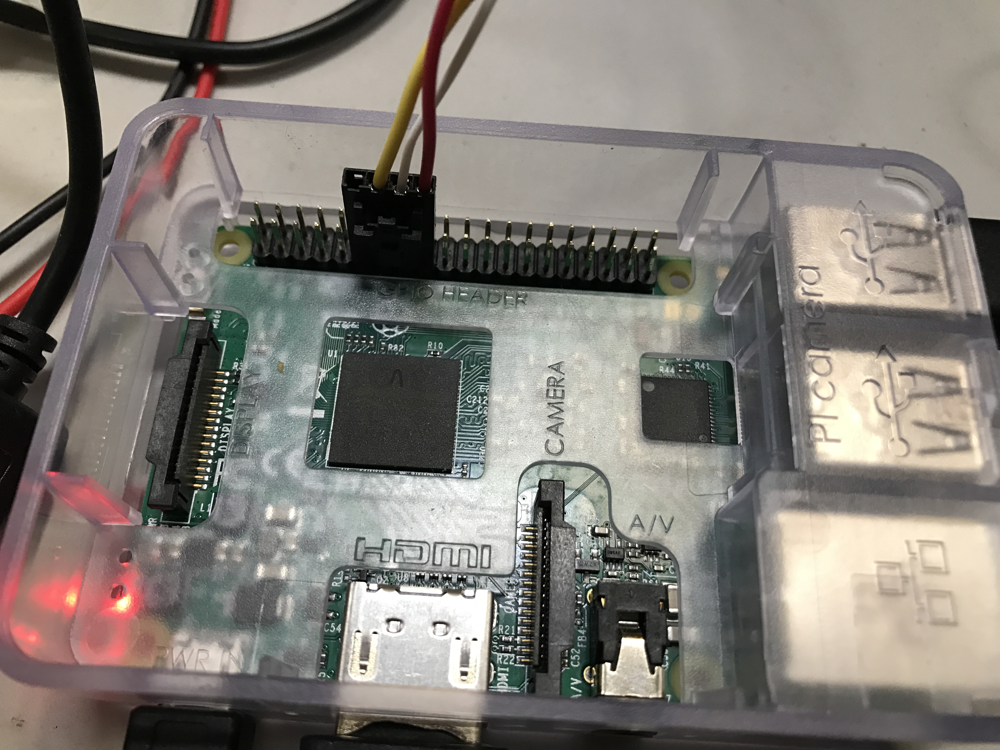
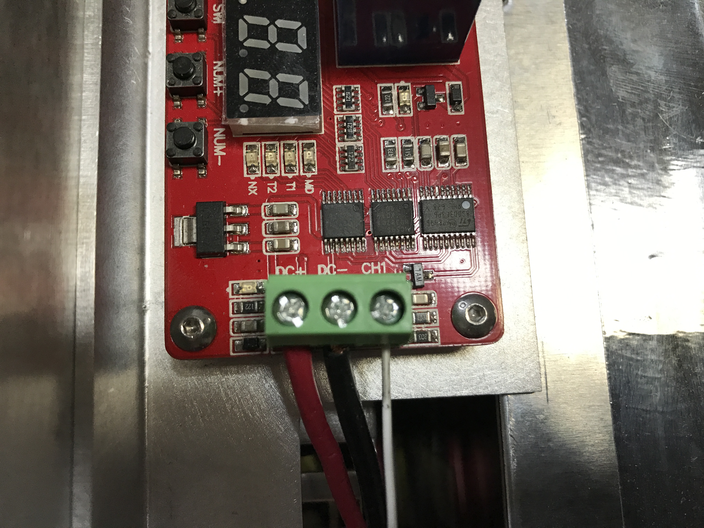
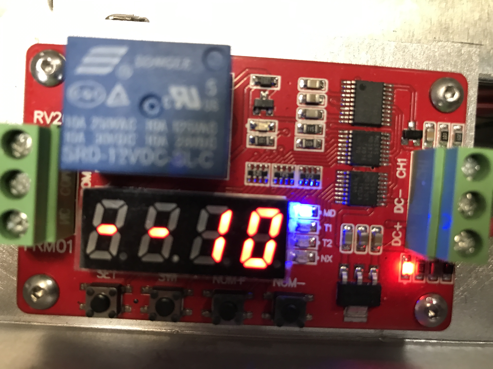
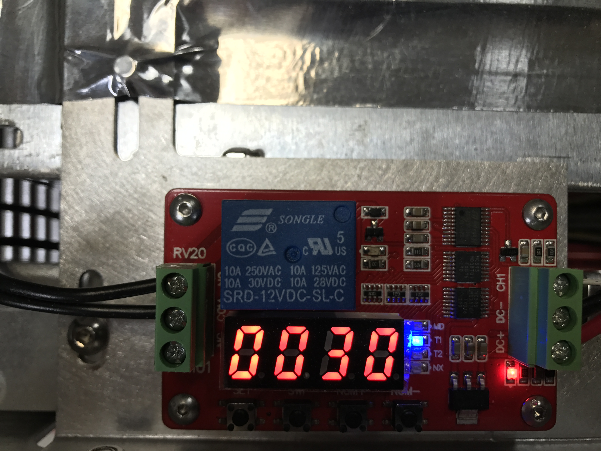
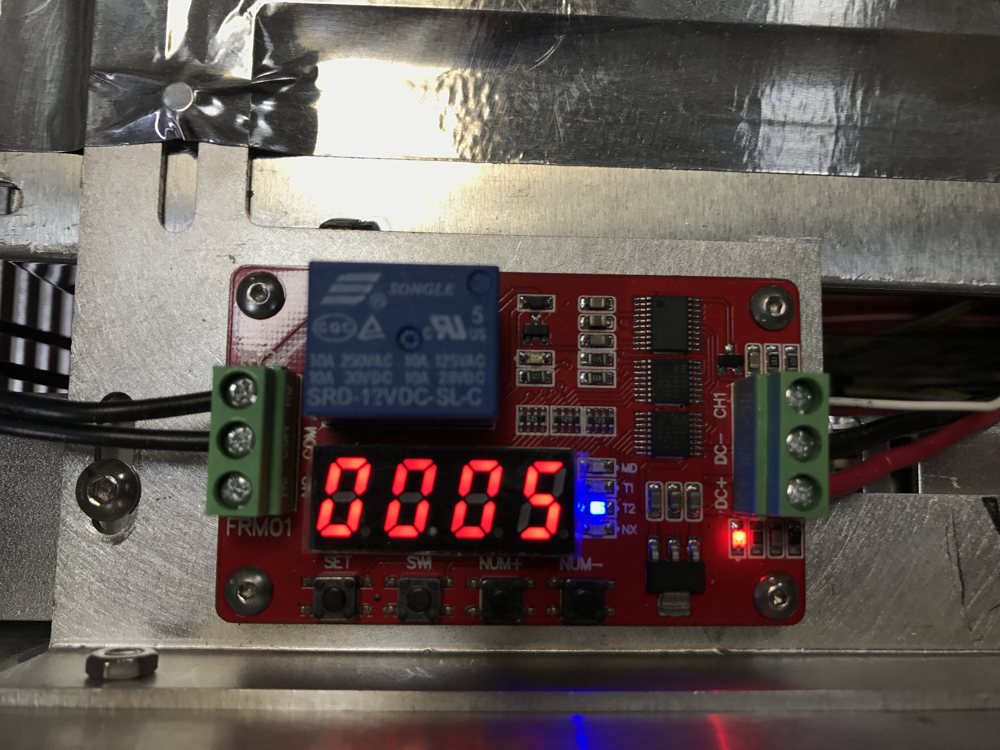
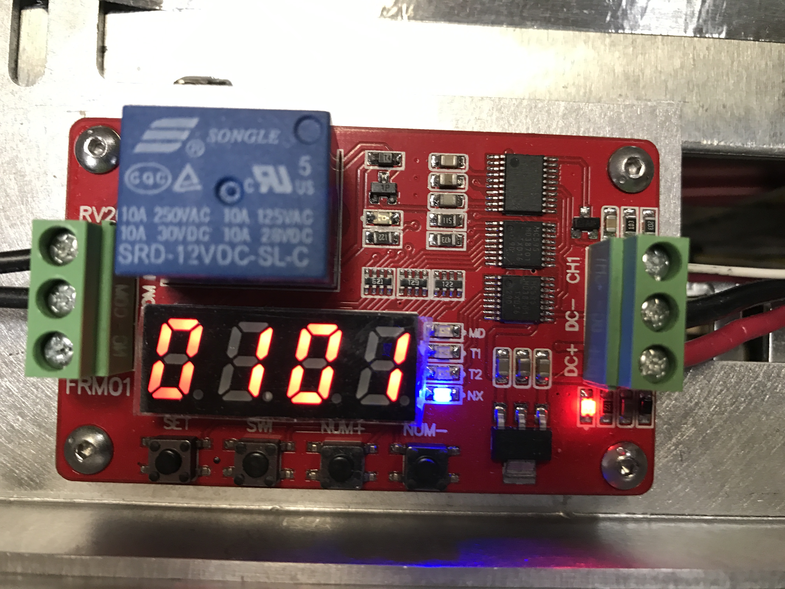

# openag_safe_shutdown
Script for safely shutting down the raspi

## Software Install
Clone repo to root
```
cd ~
git clone
```
Add script to startup automaticallyby editing rc.local
```
sudo nano /etc/rc.local
```
Add line before 'exit 0'
```
python /home/pi/openag_safe_shutdown/safe_shutdown.py
```

## Hardware Install
### Connect RPI GPIO 11/13/15/17 plug to raspberry pi


### Connect white wire to CH1 on delay relay


### Program relay now, here are steps:
1. Hold set to enter programming mode
2. Use swi to select between digit cursors
3. Use num+ / num- to increment / decrement digit
4. Move through programming features (mode / t1 / t2 / nx) by quickly pressing set
5. Save programming by holding set

### Program relay mode = 10


### Program relay t1 = 30


### Program relay t2 = 5


### Program relay nx = 0101

